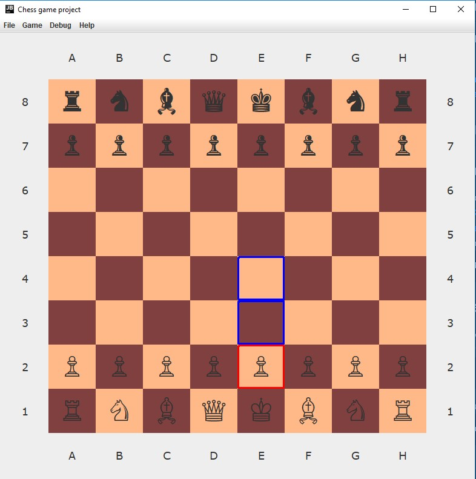
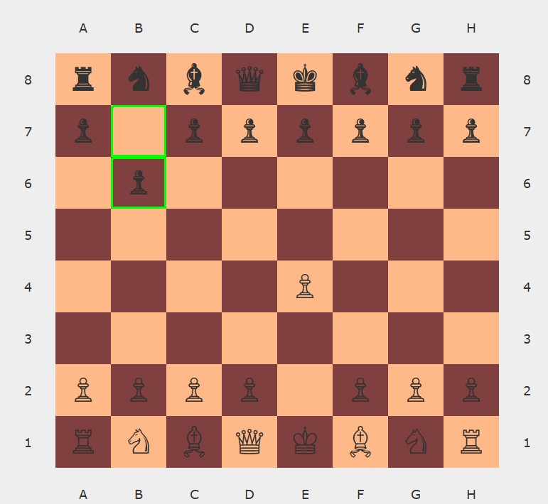
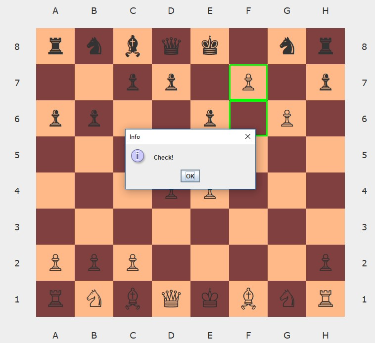
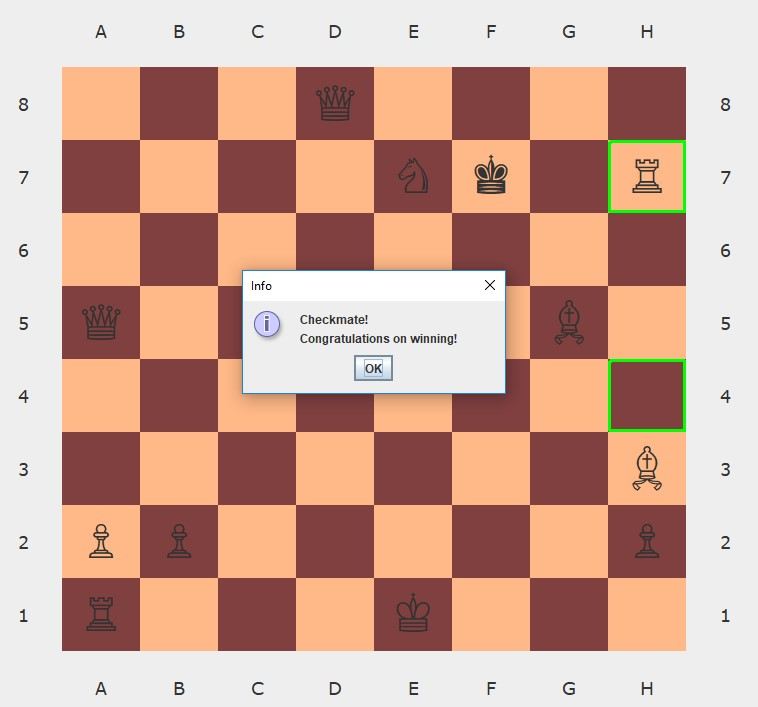
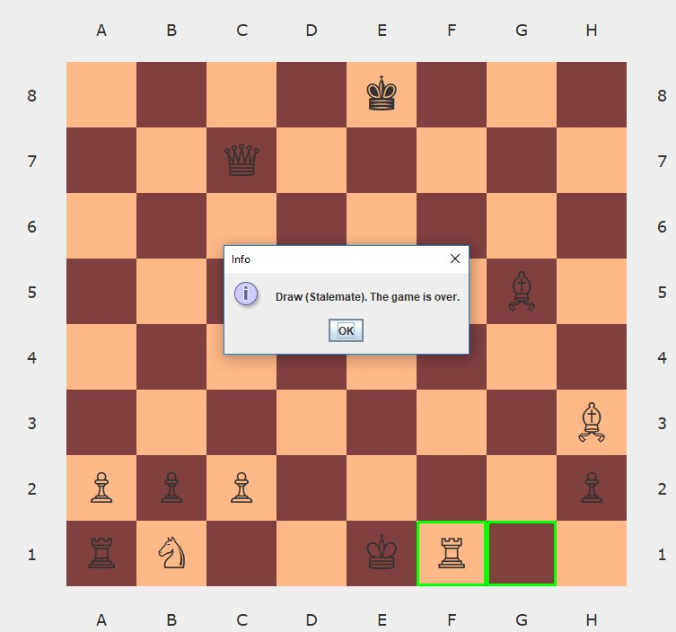
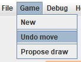
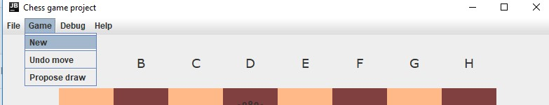
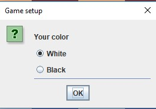
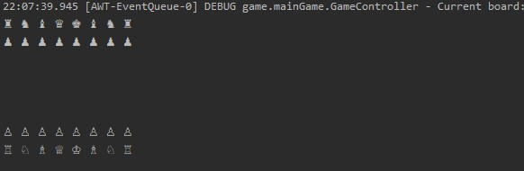

# CHESS GAME PROJECT

In order to improve my coding skills, I decided to create simple chess game using Swing.

**Game requires Java 11 to run**

## Launching the game
You can download the game as [executable jar file](https://github.com/MariuszBolek/ChessGame/blob/master/res/ChessGame.jar). 
After downloading, simply launch the file - either by double clicking the jar, or via command prompt:
````
java -jar ChessGame.jar
````

###Playing the game
When launching the game, the human player initially takes control over white pieces. Select the piece to display 
possible moves (squares with blue frame). Click the piece once again to remove selection.<br/>



After moving a piece, the opposing player moves. Both the starting and final positions of piece recently moved
are marked by green frames.<br/>



After either king is under check, the appropriate pop-up label shows up.<br/>


Game ends when either player scores a checkmate. <br/>


If a player can't make a legal move, the game ends with stalemate. <br/>


To undo last move, Select Game -> undo <br/>


To start a new game, select Game -> New, then choose a piece color <br/>
<br/>
 <br/>

In order to show current board state in console, select print to console option **(requires cloning a repository and using it 
via IDE launch)**

 <br/>



### Sites that helped me with game creation:

 1. [Chess Programming Wiki](https://www.chessprogramming.org/Main_Page)
 2. [Geeks for geeks](https://www.geeksforgeeks.org/design-a-chess-game/)
 3. [CodeReview](https://codereview.stackexchange.com/questions/71790/design-a-chess-game-using-object-oriented-principles)
 4. [Eclipse N4JS](https://www.eclipse.org/n4js/userguides/n4js-tutorial-chess/n4js-tutorial-chess.html)
 5. [Towards data science](https://towardsdatascience.com/implementing-a-chess-engine-from-scratch-be38cbdae91?source=friends_link&sk=ebc15d3d963f1e61ca1bfe7961afdcad)
 6. [FreeCodeCamp](freecodecamp.org/news/simple-chess-ai-step-by-step-1d55a9266977/)
 7. [Byanofsky](https://byanofsky.com/2017/07/06/building-a-simple-chess-ai/)